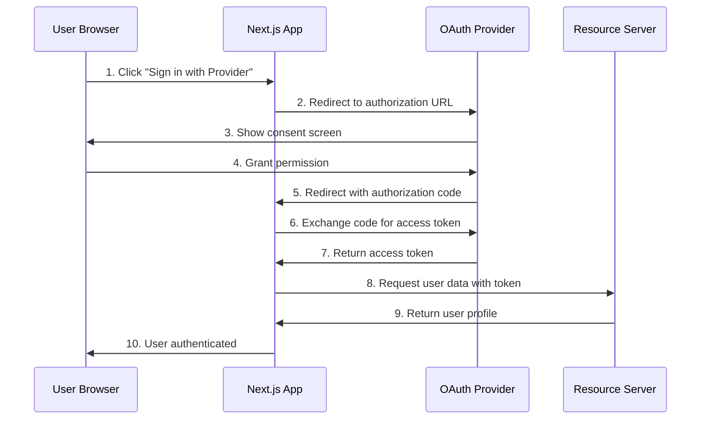

# OAuth Implementation Guide for Next.js

## Table of Contents
- [Overview](#overview)
- [OAuth Fundamentals](#oauth-fundamentals)
- [Next.js OAuth Implementation](#nextjs-oauth-implementation)
- [Privy.io OAuth Implementation](#privyio-oauth-implementation)
- [OAuth Providers Configuration](#oauth-providers-configuration)
- [Security Considerations](#security-considerations)
- [Best Practices](#best-practices)
- [Troubleshooting](#troubleshooting)

## Overview

OAuth (Open Authorization) is an industry-standard protocol for authorization that enables applications to access user data from third-party services without exposing user credentials. This guide covers implementing OAuth in Next.js applications, with special focus on Privy.io's streamlined OAuth implementation.

## OAuth Fundamentals

### OAuth 2.0 Flow

The OAuth 2.0 authorization code flow consists of 6 main steps:

1. **Authorization Request**: Application requests authorization from user
2. **Authorization Grant**: User authorizes the request
3. **Access Token Request**: Application requests access token using authorization code
4. **Access Token Response**: Authorization server issues access token
5. **Resource Request**: Application requests protected resource using access token
6. **Resource Response**: Resource server serves the protected resource



### Key Components

- **Authorization Server**: Issues access tokens (e.g., Google, GitHub, Discord)
- **Resource Server**: Hosts protected user data
- **Client Application**: Your Next.js application
- **Resource Owner**: The user granting access

## Next.js OAuth Implementation

### Traditional Next.js OAuth with NextAuth.js

#### Installation

```bash
npm install next-auth
# or
yarn add next-auth
```

#### Basic Configuration

```typescript
// pages/api/auth/[...nextauth].ts
import NextAuth from 'next-auth'
import GoogleProvider from 'next-auth/providers/google'
import GitHubProvider from 'next-auth/providers/github'
import DiscordProvider from 'next-auth/providers/discord'

export default NextAuth({
  providers: [
    GoogleProvider({
      clientId: process.env.GOOGLE_CLIENT_ID!,
      clientSecret: process.env.GOOGLE_CLIENT_SECRET!,
    }),
    GitHubProvider({
      clientId: process.env.GITHUB_ID!,
      clientSecret: process.env.GITHUB_SECRET!,
    }),
    DiscordProvider({
      clientId: process.env.DISCORD_CLIENT_ID!,
      clientSecret: process.env.DISCORD_CLIENT_SECRET!,
    })
  ],
  callbacks: {
    async session({ session, token }) {
      return session
    },
    async jwt({ token, account, profile }) {
      return token
    }
  },
  pages: {
    signIn: '/auth/signin',
    error: '/auth/error'
  }
})
```

#### Environment Variables

```env
NEXTAUTH_URL=http://localhost:3000
NEXTAUTH_SECRET=your-secret-key

# Google OAuth
GOOGLE_CLIENT_ID=your-google-client-id
GOOGLE_CLIENT_SECRET=your-google-client-secret

# GitHub OAuth
GITHUB_ID=your-github-client-id
GITHUB_SECRET=your-github-client-secret

# Discord OAuth
DISCORD_CLIENT_ID=your-discord-client-id
DISCORD_CLIENT_SECRET=your-discord-client-secret
```

#### Usage in Components

```typescript
// components/LoginButton.tsx
import { useSession, signIn, signOut } from 'next-auth/react'

export default function LoginButton() {
  const { data: session, status } = useSession()

  if (status === 'loading') return <p>Loading...</p>

  if (session) {
    return (
      <>
        <p>Signed in as {session.user?.email}</p>
        <button onClick={() => signOut()}>Sign out</button>
      </>
    )
  }
  
  return (
    <>
      <p>Not signed in</p>
      <button onClick={() => signIn('google')}>Sign in with Google</button>
      <button onClick={() => signIn('github')}>Sign in with GitHub</button>
      <button onClick={() => signIn('discord')}>Sign in with Discord</button>
    </>
  )
}
```

## Privy.io OAuth Implementation

Privy.io simplifies OAuth implementation by handling the complex authentication flows and providing a unified interface for multiple OAuth providers.

### Key Advantages of Privy.io

1. **Unified Authentication**: Single SDK for multiple OAuth providers
2. **Embedded Wallets**: Automatic crypto wallet creation
3. **Session Management**: Built-in session handling and persistence
4. **Security**: Enterprise-grade security with MFA support
5. **User Management**: Comprehensive user profile and account linking

### Installation

```bash
npm install @privy-io/react-auth
# or
yarn add @privy-io/react-auth
```

### Basic Setup

#### Environment Configuration

```env
# .env.local
NEXT_PUBLIC_PRIVY_APP_ID=your-privy-app-id
```

#### Provider Setup

```typescript
// app/layout.tsx
'use client';

import { PrivyProvider } from '@privy-io/react-auth';

export default function RootLayout({
  children,
}: {
  children: React.ReactNode;
}) {
  return (
    <html lang="en">
      <body>
        <PrivyProvider
          appId={process.env.NEXT_PUBLIC_PRIVY_APP_ID!}
          config={{
            // Configure OAuth providers
            appearance: {
              loginMethods: ['google', 'discord', 'twitter', 'apple', 'email', 'wallet']
            },
            embeddedWallets: {
              createOnLogin: 'users-without-wallets'
            }
          }}
        >
          {children}
        </PrivyProvider>
      </body>
    </html>
  );
}
```

#### Authentication Component

```typescript
// components/PrivyAuth.tsx
'use client';

import { usePrivy } from '@privy-io/react-auth';

export default function PrivyAuth() {
  const { 
    ready, 
    authenticated, 
    user, 
    login, 
    logout,
    linkGoogle,
    linkDiscord,
    linkTwitter 
  } = usePrivy();

  if (!ready) {
    return <div>Loading...</div>;
  }

  if (!authenticated) {
    return (
      <div className="space-y-4">
        <h2>Sign In</h2>
        <button 
          onClick={login}
          className="bg-blue-500 text-white px-4 py-2 rounded"
        >
          Login with Privy
        </button>
      </div>
    );
  }

  return (
    <div className="space-y-4">
      <h2>Welcome, {user?.email || user?.wallet?.address}</h2>
      
      {/* User Profile Information */}
      <div className="bg-gray-100 p-4 rounded">
        <h3>Profile Information</h3>
        <p>Email: {user?.email?.address}</p>
        <p>Wallet: {user?.wallet?.address}</p>
        <p>Google Account: {user?.google?.email || 'Not linked'}</p>
        <p>Discord Account: {user?.discord?.username || 'Not linked'}</p>
        <p>Twitter Account: {user?.twitter?.username || 'Not linked'}</p>
      </div>

      {/* Account Linking */}
      <div className="space-y-2">
        <h3>Link Additional Accounts</h3>
        {!user?.google && (
          <button onClick={linkGoogle} className="bg-red-500 text-white px-4 py-2 rounded">
            Link Google Account
          </button>
        )}
        {!user?.discord && (
          <button onClick={linkDiscord} className="bg-indigo-500 text-white px-4 py-2 rounded">
            Link Discord Account
          </button>
        )}
        {!user?.twitter && (
          <button onClick={linkTwitter} className="bg-blue-400 text-white px-4 py-2 rounded">
            Link Twitter Account
          </button>
        )}
      </div>

      <button 
        onClick={logout}
        className="bg-gray-500 text-white px-4 py-2 rounded"
      >
        Logout
      </button>
    </div>
  );
}
```

### Advanced Configuration

#### Custom Login Methods

```typescript
// Advanced Privy configuration
<PrivyProvider
  appId={process.env.NEXT_PUBLIC_PRIVY_APP_ID!}
  config={{
    appearance: {
      theme: 'dark',
      accentColor: '#676FFF',
      logo: 'https://your-domain.com/logo.png',
      loginMethods: ['google', 'discord', 'twitter', 'apple', 'email'],
      showWalletLoginFirst: false
    },
    loginMethods: {
      email: true,
      wallet: true,
      google: true,
      discord: true,
      twitter: true,
      apple: true
    },
    embeddedWallets: {
      createOnLogin: 'users-without-wallets',
      requireUserPasswordOnCreate: true
    },
    mfa: {
      noPromptOnMfaRequired: false
    }
  }}
>
  {children}
</PrivyProvider>
```

#### Email Authentication with OTP

```typescript
// components/EmailAuth.tsx
'use client';

import { useState } from 'react';
import { useLoginWithEmail } from '@privy-io/react-auth';

export default function EmailAuth() {
  const [email, setEmail] = useState('');
  const [code, setCode] = useState('');
  const { sendCode, loginWithCode, state } = useLoginWithEmail({
    onComplete: (user, isNewUser) => {
      console.log('Login successful:', { user, isNewUser });
    },
    onError: (error) => {
      console.error('Login error:', error);
    }
  });

  return (
    <div className="space-y-4">
      {state.status === 'initial' && (
        <div>
          <input
            type="email"
            value={email}
            onChange={(e) => setEmail(e.target.value)}
            placeholder="Enter your email"
            className="border p-2 rounded w-full"
          />
          <button
            onClick={() => sendCode({ email })}
            className="bg-blue-500 text-white px-4 py-2 rounded mt-2"
          >
            Send Code
          </button>
        </div>
      )}

      {state.status === 'awaiting-code-input' && (
        <div>
          <input
            type="text"
            value={code}
            onChange={(e) => setCode(e.target.value)}
            placeholder="Enter verification code"
            className="border p-2 rounded w-full"
          />
          <button
            onClick={() => loginWithCode({ code })}
            className="bg-green-500 text-white px-4 py-2 rounded mt-2"
          >
            Verify Code
          </button>
        </div>
      )}

      {state.status === 'sending-code' && <div>Sending code...</div>}
      {state.status === 'submitting-code' && <div>Verifying code...</div>}
      {state.status === 'error' && (
        <div className="text-red-500">Error: {state.error?.message}</div>
      )}
    </div>
  );
}
```

## OAuth Providers Configuration

### Google OAuth Setup

#### 1. Google Cloud Console Configuration

1. Go to [Google Cloud Console](https://console.cloud.google.com/)
2. Create a new project or select existing one
3. Enable Google+ API
4. Go to "Credentials" → "Create Credentials" → "OAuth 2.0 Client IDs"
5. Configure OAuth consent screen
6. Add authorized JavaScript origins:
   - `http://localhost:3000` (development)
   - `https://yourdomain.com` (production)
7. Add authorized redirect URIs:
   - `http://localhost:3000/api/auth/callback/google` (NextAuth)
   - `http://localhost:3000/auth/callback` (Privy)

#### 2. Environment Variables

```env
GOOGLE_CLIENT_ID=your-google-client-id
GOOGLE_CLIENT_SECRET=your-google-client-secret
```

### Discord OAuth Setup

#### 1. Discord Developer Portal

1. Go to [Discord Developer Portal](https://discord.com/developers/applications)
2. Create a new application
3. Go to "OAuth2" section
4. Add redirect URIs:
   - `http://localhost:3000/api/auth/callback/discord` (NextAuth)
   - `http://localhost:3000/auth/callback` (Privy)
5. Copy Client ID and Client Secret

#### 2. Environment Variables

```env
DISCORD_CLIENT_ID=your-discord-client-id
DISCORD_CLIENT_SECRET=your-discord-client-secret
```

### Twitter OAuth Setup

#### 1. Twitter Developer Portal

1. Go to [Twitter Developer Portal](https://developer.twitter.com/)
2. Create a new app
3. Enable "Sign in with Twitter"
4. Add callback URLs:
   - `http://localhost:3000/api/auth/callback/twitter` (NextAuth)
   - `http://localhost:3000/auth/callback` (Privy)

#### 2. Environment Variables

```env
TWITTER_CLIENT_ID=your-twitter-client-id
TWITTER_CLIENT_SECRET=your-twitter-client-secret
```

### Apple OAuth Setup

#### 1. Apple Developer Console

1. Go to [Apple Developer Console](https://developer.apple.com/)
2. Create a new identifier for "Sign in with Apple"
3. Configure domain and redirect URIs
4. Create a private key for Sign in with Apple

#### 2. Environment Variables

```env
APPLE_CLIENT_ID=your-apple-client-id
APPLE_CLIENT_SECRET=your-apple-client-secret
```

## Security Considerations

### 1. Environment Variables Security

```typescript
// Validate required environment variables
const requiredEnvVars = [
  'NEXT_PUBLIC_PRIVY_APP_ID',
  'NEXTAUTH_SECRET',
  'GOOGLE_CLIENT_ID',
  'GOOGLE_CLIENT_SECRET'
];

requiredEnvVars.forEach(varName => {
  if (!process.env[varName]) {
    throw new Error(`Missing required environment variable: ${varName}`);
  }
});
```

### 2. CSRF Protection

```typescript
// NextAuth automatically includes CSRF protection
export default NextAuth({
  // ... other config
  cookies: {
    pkceCodeVerifier: {
      name: "next-auth.pkce.code_verifier",
      options: {
        httpOnly: true,
        sameSite: "lax",
        path: "/",
        secure: process.env.NODE_ENV === "production"
      }
    }
  }
});
```

### 3. Secure Session Management

```typescript
// Privy automatic session management
const { user, authenticated } = usePrivy();

// Manually check authentication status
useEffect(() => {
  if (!authenticated) {
    // Redirect to login or show unauthenticated state
    router.push('/login');
  }
}, [authenticated]);
```

### 4. Account Linking Security

```typescript
// Secure account linking with Privy
const handleLinkAccount = async (provider: string) => {
  try {
    switch (provider) {
      case 'google':
        await linkGoogle();
        break;
      case 'discord':
        await linkDiscord();
        break;
      case 'twitter':
        await linkTwitter();
        break;
      default:
        throw new Error('Unsupported provider');
    }
  } catch (error) {
    console.error('Account linking failed:', error);
    // Handle error appropriately
  }
};
```

## Best Practices

### 1. Error Handling

```typescript
// Comprehensive error handling
const AuthComponent = () => {
  const [error, setError] = useState<string | null>(null);
  
  const handleLogin = async (provider: string) => {
    try {
      setError(null);
      await login();
    } catch (err) {
      setError(err instanceof Error ? err.message : 'Login failed');
    }
  };

  return (
    <div>
      {error && (
        <div className="bg-red-100 border border-red-400 text-red-700 px-4 py-3 rounded">
          {error}
        </div>
      )}
      {/* Login components */}
    </div>
  );
};
```

### 2. Loading States

```typescript
// Proper loading state management
const AuthStatus = () => {
  const { ready, authenticated, user } = usePrivy();

  if (!ready) {
    return (
      <div className="flex items-center justify-center p-4">
        <div className="animate-spin rounded-full h-8 w-8 border-b-2 border-blue-500"></div>
        <span className="ml-2">Loading...</span>
      </div>
    );
  }

  return (
    <div>
      {authenticated ? (
        <div>Welcome, {user?.email?.address}!</div>
      ) : (
        <div>Please sign in</div>
      )}
    </div>
  );
};
```

### 3. TypeScript Integration

```typescript
// Type-safe user handling
interface ExtendedUser {
  id: string;
  email?: string;
  wallet?: {
    address: string;
    chainType: 'ethereum' | 'solana';
  };
  google?: {
    email: string;
    name: string;
  };
  discord?: {
    username: string;
    discriminator: string;
  };
}

const UserProfile: React.FC = () => {
  const { user } = usePrivy();
  const typedUser = user as ExtendedUser;

  return (
    <div>
      <h2>User Profile</h2>
      <p>Email: {typedUser?.email}</p>
      <p>Wallet: {typedUser?.wallet?.address}</p>
      {typedUser?.google && (
        <p>Google: {typedUser.google.name} ({typedUser.google.email})</p>
      )}
    </div>
  );
};
```

### 4. Middleware for Protected Routes

```typescript
// middleware.ts
import { NextResponse } from 'next/server';
import type { NextRequest } from 'next/server';

export function middleware(request: NextRequest) {
  // Add authentication checks here
  const token = request.cookies.get('privy-token');
  
  if (!token && request.nextUrl.pathname.startsWith('/dashboard')) {
    return NextResponse.redirect(new URL('/login', request.url));
  }

  return NextResponse.next();
}

export const config = {
  matcher: ['/dashboard/:path*', '/profile/:path*']
};
```

## Troubleshooting

### Common Issues and Solutions

#### 1. CORS Errors

```typescript
// Ensure proper CORS configuration
// next.config.js
module.exports = {
  async headers() {
    return [
      {
        source: '/api/auth/:path*',
        headers: [
          { key: 'Access-Control-Allow-Origin', value: '*' },
          { key: 'Access-Control-Allow-Methods', value: 'GET,POST,OPTIONS' },
          { key: 'Access-Control-Allow-Headers', value: 'Content-Type' },
        ],
      },
    ];
  },
};
```

#### 2. Redirect URI Mismatch

Ensure redirect URIs in OAuth provider settings match exactly:
- Development: `http://localhost:3000/auth/callback`
- Production: `https://yourdomain.com/auth/callback`

#### 3. Session Persistence Issues

```typescript
// Ensure proper session configuration
export default NextAuth({
  session: {
    strategy: 'jwt',
    maxAge: 30 * 24 * 60 * 60, // 30 days
  },
  jwt: {
    maxAge: 30 * 24 * 60 * 60, // 30 days
  }
});
```

#### 4. Environment Variable Issues

```typescript
// Debug environment variables
console.log('Environment check:', {
  hasPrivyAppId: !!process.env.NEXT_PUBLIC_PRIVY_APP_ID,
  hasGoogleClientId: !!process.env.GOOGLE_CLIENT_ID,
  nodeEnv: process.env.NODE_ENV
});
```

### Debugging Tips

1. **Enable Debug Logging**: Set `debug: true` in Privy config
2. **Check Network Tab**: Monitor OAuth flows in browser dev tools
3. **Validate Tokens**: Use JWT debugger to inspect tokens
4. **Test Redirect URIs**: Ensure all redirect URIs are correctly configured

## Conclusion

OAuth implementation in Next.js can be achieved through traditional methods like NextAuth.js or modern solutions like Privy.io. Privy.io offers significant advantages for Web3 applications by providing:

- Simplified integration
- Built-in wallet functionality
- Enhanced security features
- Unified user management
- Multi-provider support

Choose the approach that best fits your application's requirements, considering factors like complexity, Web3 integration needs, and development timeline. 